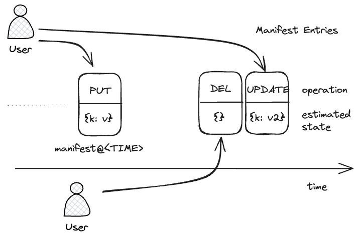

# The sync protocol for a client-side, causally consistent, multiplayer DB over the S3 API

This is a focussed explanation of the core sync protocol of MPS3. The sync protocol upgrades an S3 API into a causally consistent, multiplayer datastore without the use of intermediate servers.
## Why build over S3?

1. Minimalism. Why bother maintaining server-side code or a database when the bucket holding the website is a serviceable persistent state store. 

2. Curiosity. Is it even possible to build a database on the S3 API? This project is a demonstration that yes it is.

3. Flexibility. Database are one of the least portable parts of a stack. Decoupling storage from the database enables many more options like self-hosting with ceph or minio or pick hosting on one of a myriad of cloud vendors that support the S3 API.

## S3 features used by MPS3

### `PUT and GET /<bucket>/<key>

The basic S3 API is very simple and intuitive. You use a HTTP `PUT <endpoint>/<bucket>/<key>` to set a file, and `GET <endpoint>/<bucket>/<key>` to retrieve it later. It is the obvious API if you wanted namespaced storage over a RESTFul interface. 

### Response headers: `etag`, `date`, `x-amz-version-id`, `LastModified`

There are additional features using standard HTTP features like `etag` which help with network efficiency. S3 returns the `Date` which is useful for as an authoritative clock source. There are also additional features like versioned objects which help with lifecycle management of resources. And `LastModified` which records the time the write was performed. Every vendor I have tested supports etags on `GET` requests but not object versioning (e.g. Cloudflare R2 doesn't).

### `GET /<bucket>?list-object-v2&prefix=<PREFIX> 

To list the objects you `GET <endpoint>/<bucket>` which returns XML and is ordered and paginated. The result set includes the keys and the etags of the resource. By providing a prefix you target a subset of the buckets contents.

### S3 Strong Consistency Guarantees

S3 states strong consistency between its GET, PUT and list operations.

*After a successful write of a new object, or an overwrite or delete of an existing object, any subsequent read request immediately receives the latest version of the object. S3 also provides strong consistency for list operations, so after a write, you can immediately perform a listing of the objects in a bucket with any changes reflected.* -- [S3 docs](https://aws.amazon.com/s3/consistency/)

### S3 is an Immutable Key-Value store with a single index

S3 is an immutable key value store for (potentially very large) binary blobs. The keys are limited in size (1kb), but you can to range queries by prefix query in one direction only.

It doesn't have some common features like conditional writes, and you cannot update objects in-place. So its tricky getting multiplayer out of this system, but possible thanks to the strong consistency guarantees.

## MPS3

MPS3 is a Key Value store. The values are stored in versioned storage locations on S3. There is a layer of indirection that maps DB logical keys to storage locations hosted in a *manifest*

### Atomic Multi key Operations

To enable consistent atomic updates of multiple keys, *first* the client writes the new values, then it updates the *manifest*, not dissimilar to write-ahead-logging. Other clients use the manifest to access the DB, thus, because individual S3 file updates are atomic, writing a new manifest file is also an atomic operation that can flip the visibility a multiple of key updates at once.

The manifest is a layer of *indirection* enabling bulk atomic operation (and more)

### Multiplayer Safe

Concurrent writes would conflict if all clients wrote to the *same* manifest location. There is no conditional writes in S3 so some updates would just be lost. To support multiplayer each client updates a *different* manifest file ordered by time.



The manifest records several major pieces of imperfect information.
- The time of the write, encoded in the key, as measured at the client. Client clocks are subject to clock skew so it might be a bit off.
- The operation that was applied, encoded a JSON merge patch to the DB state.
- The state of the database, but this also might be off because a client doesn't know what other writes are also in flight when written. But it's the client's best guess.

```
// manifest.json@01698260777020_53a_0001
{
	operation: { // Exact JSON-merge-PATCH representation of manifest operation
		keys: {
			"myBucket/oldKey": null, // DELETE
			"myBucket/myKey": {
				version: "2eefe4fb-c540-4482-abb7-f3dfedfc424d"
			}
		}
	},
	state: { // Approximation of current state
		keys: {
			"myBucket/myKey": {
				version: "2eefe4fb-c540-4482-abb7-f3dfedfc424d"
			}
		}
	},
}
```

Much of the engineering of the MPS3 sync protocol is about transforming that imperfect information into a causally consistent, atomic, multiplayer safe representation client-side.

### Reconciling concurrent writes

Note the client sends the operation as a [JSON_merge_patch](JSON_merge_patch.md). The database state at time *t* is the merge concatenation of all the operations up to *t* (see [a list of patches forms an ordered log](JSON_merge_patch.md#a-list-of-patches-forms-an-ordered-log))

$$state_t = \sum_{i=0}^{t} merge(patch_i)$$
Now it is inefficient for a client to replay the entire DB history. But we can use the [idempotency property of JSON-merge-patch](JSON_merge_patch.md#a-list-of-patches-forms-an-ordered-log#Ordered Logs can be replayed multiple times) to avoid it.

A client only needs to read an imperfect guess of the latest state, then replay all patches within a *lag* window to correct an estimate of the final state (see [Ordered Logs with missing entries can be repaired with replay](JSON_merge_patch.md#Ordered Logs with missing entries can be repaired with replay))

$$\begin{eqnarray} 
state_t &=& state_{t-lag} + \sum_{i=lag}^{t} merge(patch_i) \\
&=& est_t + \sum_{i=lag}^{t} merge(patch_i)
\end{eqnarray}$$

So this is the key insight encoded within MPS3 manifest representation. The state field provides a good guess, but clients need to look back "a bit" and apply a sequence of operations to correct for missing writes.

### Causal Consistency

If clients clocks are skewed, their manifest keys will not order between them correctly. This does not matter though! To preserve causal consistency, a specific client's writes must remain in the same order for all participants. Clock skew translates, but does not reorder, operations in time, so causal consistency is not undermined.

The sync protocol is eager, exposing all operations as soon as they are visible, so clock skew does not affect end-to-end latency either. The only effect is on ordering within the log which can be observed when writing to the same key. Delayed clients will appear to be affecting the database in the past, which means their operations are more easily masked by other clients.

### Mitigating Large clock skew

Clock skew becomes a consistency threatening problem if exceeding the *lag* window. Then the reconciliation algorithm will not be looking far enough back and will miss operations. Client clocks cannot be trusted. 

Large clock skew is detected by MPS3 by comparing the manifest key timestamp against the server provided `LastModified` time. If the skew is above a *stale* write threshold it is ignored. As long as the *stale* write threshold is sufficiently below the *lag* parameter, all clients will converge to the same state regardless of clock skew.

### Automatic Clock Adjustment

In addition, clients use the `Date` header to continuously correct their clocks, so clients with heavily skewed clocks are able to be corrected reactively and continuously and thus capable of joining the log.

### Subtleties of the manifest key

The manifest key is primarily time ordered, but some extra information is needed to fix edge cases such as: writing on the exact same millisecond or using a sub millisecond S3 API (such as local-first). So the manifest key format is actually

```
<TIMESTAMP>_<SESSION>_<COUNTER>
```

Furthermore, because S3's `list-objects-v2` operation can only query in ascending lexicographical order, and its more efficient for the algorithm to look backwards in descending order, both the timestamp and counter elements are encoded with a reverse lexicographically ordered string. Key length is a limited resource, so we use a Javascript's native base-32 string representation, padded and subtracted from the max value to reverse the directions

```js
export const uint2strDesc = (num: number, bits: number): string => {
  const maxValue = Math.pow(2, bits) - 1;
  return uint2str(maxValue - num, bits);
};

const uint2str = (num: number, bits: number) => {
  const maxBase32Length = Math.ceil(bits / 5);
  const base32Representation = num.toString(32);
  return base32Representation.padStart(maxBase32Length, "0");
};
```

### Minimising list-object-v2 calls

List API calls are costly on S3. As the subscription features of MPS3 rely on polling, we want to avoid having the list-object-v2 API calls being part of the poll loop. After writing a new manifest entry, the client touches a `last_change` file. Clients with active subscriptions poll this file and only if the content changes (efficiently detected with `If-None-Match` header), does the algorithm proceed to syncing the latest state via the `list-object-v2` API call.

For APIs where listing is cheap (e.g. local-first/IndexDB), this optimisation can be disabled by the `minimizeListObjectsCalls` flag to `false`. 

## The Sync Algorithm

Loop:
1. Poll the `last_change` file using `If-None-Match` headers, if it hasn't changed go no further
2. List objects backwards in time from the `now + lag`
3. Filter out entries whose `abs(timestamp - LastModified) > stale` 
4. json-merge-patch all `operations` in order into the most recent `state`
5. notify subscribers of changes

Operations observed on S3 are exposed to clients as soon as they are read, there is no waiting. The existence of clock skew neither compromises causal consistency nor end-to-end latency.
### Summary

The algorithm is deceptively simply in implementation but leans heavily on the algebraic property of JSON-merge-patch and wiggle room in causal consistency to accommodate client-side clock_skew. The same algorithm is used also to synchronise state transfer between tabs in the local-first setting. By designing for a relatively small set of underlying primitives, it is to apply this sync protocol to more expressive storage system.